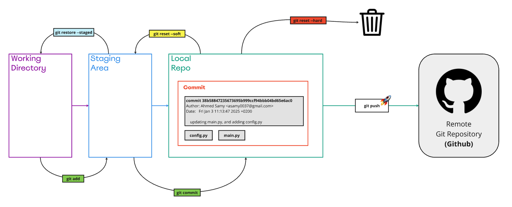

##  how to remove the branches locally and remotely
  - locally : we can use this command -d to remove merged branch, and we can use -D to enforce removing a non-merged branch.
  ```
  git branch -d <branch-name>

  ```
  - remotely : we can use this command 
  ```
  git push origin --delete <branch-name>

  ```
## Annotated tags vs Lightweight Tags 
- Annotated tage : Used for releases or when you need detailed information or signing capabilities. They are more robust and better suited for long-term reference.
 ```git
  git tag -a v2.0 -m “version 2.0”

 ```
- Lightweight Tags: Used for internal, informal references when you don’t need extra metadata or signing.
```git
git tag v1.0
```
## How to list tag
- using the command :
```git
 git tag
```

## When to user Rebase
I want the point at which I branched to move to a new starting point 
- Use rebase to catch up with the commits on another branch as you work with a local feature branch. This is especially useful when working in long-running feature branches to check how your changes work with the latest updates on the master branch.


## How to delete tag locally and remotely
- locally:  use the following command:
```git
git tag -d <tagname>
```
- remotely : use the following command:
```
git push origin --delete <tagname>

```

### Adding image to readme file

